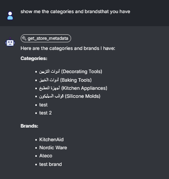

# Shehab Store Assistant 🤖
[](https://flowiseai.com/)
[](https://github.com/FlowiseAI/Flowise)

**Shehab** is a sophisticated LLM-powered store assistant designed to provide a seamless e-commerce experience. Built using **Flowise**, Shehab acts as an intelligent agent capable of interacting with live APIs to retrieve product information, metadata, and featured collections.


## 🛠️ Custom AI Tools
Shehab is equipped with specialized JavaScript tools that bridge the gap between the LLM and the store's backend:

1.  **Product & Package Search**: Dynamically queries the store database for products and multi-item packages based on user intent.
2.  **Metadata Retrieval**: Fetches essential store configuration and contextual data.
3.  **Collection Filtering**: Intelligent categorization and display of featured collections (e.g., newest arrivals, best sellers).

## 📂 Project Structure
- `tools/`: Contains the JavaScript implementation for Shehab's custom agent tools.
- `.screenshots/`: Visual documentation of the agent's flow and design.

## 📸 Functionality Overview
<div align="center">
  
  
</div>

## 🚀 Technical Implementation
The agent utilizes a retrieval-augmented generation (RAG) approach combined with custom tool-calling. The tools are optimized for a **Laravel-based backend** API, ensuring real-time accuracy.

### Example Tool: Product Search
```javascript
const url = `${baseUrl}?query=${encodeURIComponent(query)}&find_packages=${find_packages}`;
// Fetches real-time product data for the LLM to process
```

---
### 👤 Developer
**Fawaz Allan**  
AI & LLM Agent Specialist  

📧 [Gmail](mailto:fwzallan@gmail.com) | 💼 [LinkedIn](https://www.linkedin.com/in/fawaz-allan-188717247/)
