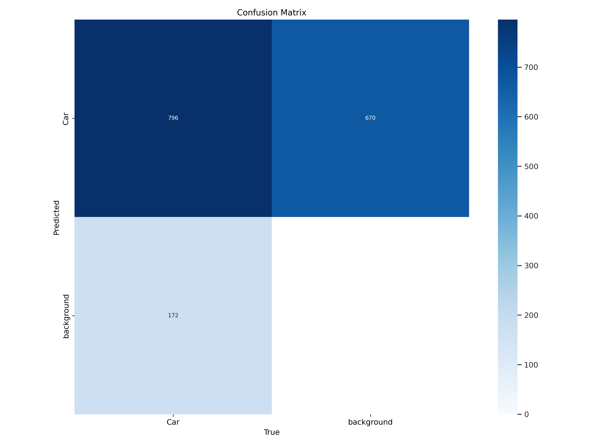
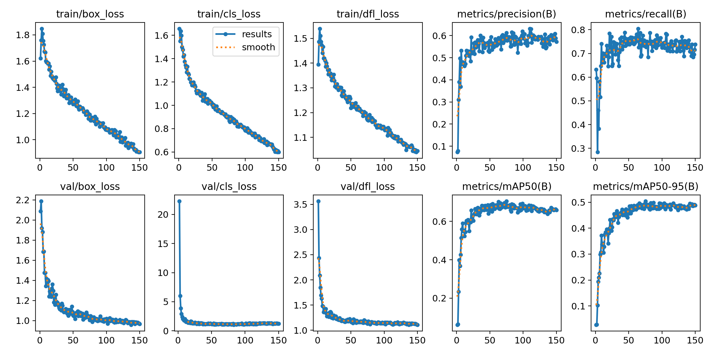

# Smart Traffic Management System 🚦
[](https://github.com/ultralytics/ultralytics)
[](https://pytorch.org/)
[](https://opensource.org/licenses/MIT)

**Graduation Project | AI-Driven Density Control**

This project addresses metropolitan congestion by implementing a smart, density-aware traffic signal controller. Using **YOLOv11**, the system analyzes real-time surveillance feeds to calculate vehicle density and dynamically adjusts signal timing to prioritize crowded intersections.

## 📈 Project Flow
.png)

## ✨ Core Features
- **Dynamic Signal Timing**: Automatically adds +10 seconds to the green light phase of the intersection with the highest car density.
- **Vehicle Recognition (YOLOv11)**: High-performance detection of cars, trucks, and buses.
- **License Plate OCR**: Integration for vehicle identification and plate reading (Jordanian plates).
- **Traffic Sign Recognition**: Real-time detection of traffic signs for auxiliary safety.
- **Interactive UI**: Gradio-based dashboards for monitoring model performance and detection results.

## 🏗️ System Architecture
The system is composed of several specialized AI models:
1. **Traffic Jam Analysis**: Dedicated YOLOv11 model for calculating car counts across 4 traffic lights.
2. **Plate Detection**: Identifies and crops license plates from vehicle images.
3. **Number OCR**: Specialized model for extracting numerical data from license plates.
4. **Sign Detection**: Recognizes traffic signs to ensure compliance.

## 📊 Model Performance
The models were trained extensively on custom datasets. Below are the performance metrics for the density and plate recognition modules:

| Accuracy Metrics (YOLOv11) | Results Graph |
| :---: | :---: |
|  |  |

## 📸 Screenshots
<div align="center">
  
  
  
</div>

## 🛠️ Installation
1. Install dependencies:
   ```bash
   pip install ultralytics opencv-python gradio torch
   ```
2. Download the YOLOv11 weights to the `weights` folder.
3. Run the main traffic light controller:
   ```bash
   python "Traffic Light Management.py"
   ```

## 👨‍🎓 Graduation Project
Developed as part of the graduation requirements, focusing on the intersection of Computer Vision and Smart City infrastructure.

---
### 👤 About the Author
**Fawaz Allan**  
AI & Computer Vision Developer  

📧 [Gmail](mailto:fwzallan@gmail.com) | 💼 [LinkedIn](https://www.linkedin.com/in/fawaz-allan-188717247/)
